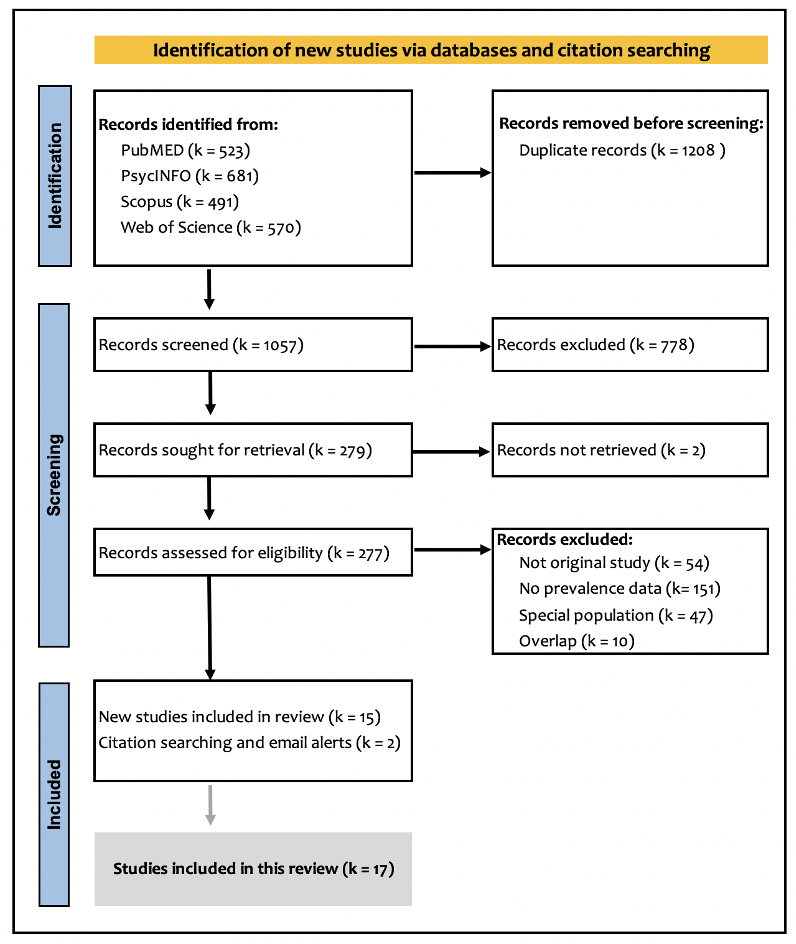

<style>

#TOC {
 position: fixed;
  left: 0;
  top: 0;
  width: 200px;
  height: 400%;
  overflow:auto;
}
body {
  max-width: 3000px;
  margin: auto;
  margin-left:100px;
  margin-right:100px;
  line-height: 20px;
}
h1.title {
    font-size: 32px;
}
h4 {
    font-size: 15px;
}
h3 {
    font-size: 16px;
}
h2 {
    font-size: 20px;
}
h1 {
    font-size: 30px;
}
.center {
    display: block;
    margin-left: auto;
    margin-right: auto;
    width: 28%;
}
.table {
    width: 40%;
}
</style>

<br>
<br>


```{r setup, include=FALSE}
knitr::opts_chunk$set(echo = TRUE)
library(here)
library(metafor)
library(meta)
library(ggplot2)
library(dplyr)
library(plotly)
#library(wesanderson)
library(LaCroixColoR)
group2 <- read.csv("group2c.csv",stringsAsFactors = F) # grades 6-12
group3 <- read.csv("group2d.csv",stringsAsFactors = F)
group4 <- read.csv("group2e.csv",stringsAsFactors = F) # all surveys combined
```

<br>

# PRISMA diagram
```{r, echo=FALSE, out.width = '70%', out.height= '70%'}

```

<br>
<br>

# Lifetime + 30 day prevalence (products)

<br>
<br>

### Prevalence by year 

<br>
<br>

```{r,echo = FALSE, warning = FALSE,fig.width = 12, fig.height=4 }
group3_LT<- group3 %>% 
  filter(product == "cannabis oil"| product == "dried herbs"|product == "concentrates") %>%
  mutate(prop = round(w.cases/total,3)*100)

p<- ggplot(group3_LT, aes(x = factor(year), y = prop)) +
  geom_point(aes(color = product, shape = product, alpha=0.5), size = 3.5) +
  scale_colour_manual(values = lacroix_palette("PassionFruit", n=3)) +
  xlab("Survey year") +
  ylab("Weighted %") +
  scale_y_continuous(limits = c(0, 80)) + 
    theme(legend.title = element_blank()) +
  theme(axis.text=element_text(size=10),text = element_text(size=12))+
  theme(legend.position="bottom") +
  facet_wrap(~ country)
ggplotly(p)
```

<br>
<br>

# LT National + State surveys (U.S and Canada)

<br>
<br>

### Prevalence by year 2013-16

<br>
<br>


```{r,echo = FALSE, warning = FALSE }
group2_LT<- group2 %>% 
  filter(timing == "lifetime") %>%
  filter(grade1 != "all") %>%
  filter(year1 == 1) %>%
  mutate(year1 = as.numeric(year1)) %>%
  mutate(prop = round(w.cases/total,3)*100)
group4_LT<- group4 %>% 
  filter(timing == "lifetime") %>%
  #filter(grade != "all") %>%
  filter(year1 == 1) %>%
  mutate(year1 = as.numeric(year1)) %>%
  mutate(prop = round(w.cases/total,3)*100)
```

<br>
<br>

### Meta-analysis  

<br>
<br>

```{r,echo = FALSE, warning = FALSE, fig.width = 10, fig.height=14}
# logit transformation
ies.logit <- escalc(xi = w.cases,ni = total, data=group2_LT, measure = "PLO")
b<-metaprop(event=w.cases, n=total, studlab=author2, sm="PLO", data=ies.logit, method="Inverse", method.tau="DL", digits = 3,byvar=droplevels(factor(grade1)))
b
forest(b,digits = 3,transf= transf.ilogit.int)
```

<br>
<br>

```{r, fig.width = 10, fig.height=14}
ies.logit <- escalc(xi = w.cases,ni = total, data=group4_LT, measure = "PLO")
b<-metaprop(event=w.cases, n=total, studlab=author2, sm="PLO", data=ies.logit, method="Inverse", method.tau="DL", digits = 3)
b
forest(b,digits = 3,transf= transf.ilogit.int)
```

<br>
<br>

### Prevalence by year 2017-18

<br>
<br>


```{r,echo = FALSE, warning = FALSE }
# Meta-analysis (National, State)
group2_LT<- group2 %>% 
  filter(timing == "lifetime") %>%
  filter(grade != "all") %>%
  filter(year1 == 2) %>%
  mutate(year1 = as.numeric(year1)) %>%
  mutate(prop = round(w.cases/total,3)*100)
group4_LT<- group4 %>% 
  filter(timing == "lifetime") %>%
  #filter(grade != "all") %>%
  filter(year1 == 2) %>%
  mutate(year1 = as.numeric(year1)) %>%
  mutate(prop = round(w.cases/total,3)*100)
```

<br>
<br>

### Meta-analysis  

<br>
<br>

```{r,echo = FALSE, warning = FALSE, fig.width = 10, fig.height=14}
# logit transformation
ies.logit <- escalc(xi = w.cases,ni = total, data=group2_LT, measure = "PLO")
b<-metaprop(event=w.cases, n=total, studlab=author2, sm="PLO", data=ies.logit, method="Inverse", method.tau="DL", digits = 3,byvar=droplevels(factor(grade1)))
b
forest(b,digits = 3,transf= transf.ilogit.int)
```

<br>
<br>

```{r, fig.width = 10, fig.height=14}
ies.logit <- escalc(xi = w.cases,ni = total, data=group4_LT, measure = "PLO")
b<-metaprop(event=w.cases, n=total, studlab=author2, sm="PLO", data=ies.logit, method="Inverse", method.tau="DL", digits = 3)
b
forest(b,digits = 3,transf= transf.ilogit.int)
```

<br>
<br>

### Prevalence by year 2019-20

<br>
<br>


```{r,echo = FALSE, warning = FALSE }
# Meta-analysis (National, State)
group2_LT<- group2 %>% 
  filter(timing == "lifetime") %>%
  filter(grade != "all") %>%
  filter(year1 == 3) %>%
  mutate(year1 = as.numeric(year1)) %>%
  mutate(prop = round(w.cases/total,3)*100)
group4_LT<- group4 %>% 
  filter(timing == "lifetime") %>%
  #filter(grade != "all") %>%
  filter(year1 == 3) %>%
  mutate(year1 = as.numeric(year1)) %>%
  mutate(prop = round(w.cases/total,3)*100)
```

<br>
<br>

### Meta-analysis  

<br>
<br>

```{r,echo = FALSE, warning = FALSE, fig.width = 10, fig.height=14}
# logit transformation
ies.logit <- escalc(xi = w.cases,ni = total, data=group2_LT, measure = "PLO")
b<-metaprop(event=w.cases, n=total, studlab=author2, sm="PLO", data=ies.logit, method="Inverse", method.tau="DL", digits = 3,byvar=droplevels(factor(grade1)))
b
forest(b,digits = 3,transf= transf.ilogit.int)
```

<br>
<br>

```{r, fig.width = 10, fig.height=14}
# logit transformation
ies.logit <- escalc(xi = w.cases,ni = total, data=group4_LT, measure = "PLO")
b<-metaprop(event=w.cases, n=total, studlab=author2, sm="PLO", data=ies.logit, method="Inverse", method.tau="DL", digits = 3)
b
forest(b,digits = 3,transf= transf.ilogit.int)
```

<br>
<br>

## (REGROUP) 12-m National + State surveys

<br>
<br>
  
### Prevalence by year 2017-18
  
<br>
<br>
  
```{r,echo = FALSE, warning = FALSE }
# Meta-analysis (National, State)
group2_12m<- group2 %>% 
  filter(timing == "12-month") %>%
  filter(grade != "all") %>%
  filter(year1 == 2) %>%
  mutate(year1 = as.numeric(year1)) %>%
  mutate(prop = round(w.cases/total,3)*100)
group4_12m<- group4 %>% 
  filter(timing == "12-month") %>%
  #filter(grade != "all") %>%
  filter(year1 == 2) %>%
  mutate(year1 = as.numeric(year1)) %>%
  mutate(prop = round(w.cases/total,3)*100)
```

<br>
<br>
  
### Meta-analysis  
  
<br>
<br>
  
```{r,echo = FALSE, warning = FALSE, fig.width = 10, fig.height=14}
# logit transformation
ies.logit <- escalc(xi = w.cases,ni = total, data=group2_12m, measure = "PLO")
b<-metaprop(event=w.cases, n=total, studlab=author2, sm="PLO", data=ies.logit, method="Inverse", method.tau="DL", digits = 3,byvar=droplevels(factor(grade1)))
b
forest(b,digits = 3,transf= transf.ilogit.int)
```

<br>
<br>
  
```{r,echo = FALSE, fig.width = 10, fig.height=14}
# logit transformation
ies.logit <- escalc(xi = w.cases,ni = total, data=group4_12m, measure = "PLO")
b<-metaprop(event=w.cases, n=total, studlab=author2, sm="PLO", data=ies.logit, method="Inverse", method.tau="DL", digits = 3)
b
forest(b,digits = 3,transf= transf.ilogit.int)
```

<br>
<br>

### Prevalence by year 2019-20

<br>
<br>
  
  
```{r,echo = FALSE, warning = FALSE }
# Meta-analysis (National, State)
group2_12m<- group2 %>% 
  filter(timing == "12-month") %>%
  filter(grade != "all") %>%
  filter(year1 == 3) %>%
  mutate(year1 = as.numeric(year1)) %>%
  mutate(prop = round(w.cases/total,3)*100)
group4_12m<- group4 %>% 
  filter(timing == "12-month") %>%
  #filter(grade != "all") %>%
  filter(year1 == 3) %>%
  mutate(year1 = as.numeric(year1)) %>%
  mutate(prop = round(w.cases/total,3)*100)
```

<br>
<br>
  
### Meta-analysis  
  
<br>
<br>
  
```{r,echo = FALSE, warning = FALSE, fig.width = 10, fig.height=14}
# logit transformation
ies.logit <- escalc(xi = w.cases,ni = total, data=group2_12m, measure = "PLO")
b<-metaprop(event=w.cases, n=total, studlab=author2, sm="PLO", data=ies.logit, method="Inverse", method.tau="DL", digits = 3,byvar=droplevels(factor(grade1)))
b
forest(b,digits = 3,transf= transf.ilogit.int)
```

<br>
<br>
<br>

```{r, fig.width = 10, fig.height=14}
# logit transformation
ies.logit <- escalc(xi = w.cases,ni = total, data=group4_12m, measure = "PLO")
b<-metaprop(event=w.cases, n=total, studlab=author2, sm="PLO", data=ies.logit, method="Inverse", method.tau="DL", digits = 3)
b
forest(b,digits = 3,transf= transf.ilogit.int)
```

<br>
<br>

## (REGROUP) 30d National + State surveys
  
<br>
<br>
  
### Prevalence by year 2013-16
  
<br>
<br>
  
  
```{r,echo = FALSE, warning = FALSE }
# Meta-analysis (National, State)
group2_30d<- group2 %>% 
  filter(timing == "30-day") %>%
  filter(grade != "all") %>%
  filter(year1 == 1) %>%
  mutate(year1 = as.numeric(year1)) %>%
  mutate(prop = round(w.cases/total,3)*100)
group4_30d<- group4 %>% 
  filter(timing == "30-day") %>%
  #filter(grade != "all") %>%
  filter(year1 == 1) %>%
  mutate(year1 = as.numeric(year1)) %>%
  mutate(prop = round(w.cases/total,3)*100)
```

<br>
<br>
  
### Meta-analysis  
  
<br>
<br>
  
```{r,echo = FALSE, warning = FALSE, fig.width = 10, fig.height=14}
# logit transformation
ies.logit <- escalc(xi = w.cases,ni = total, data=group2_30d, measure = "PLO")
b<-metaprop(event=w.cases, n=total, studlab=author2, sm="PLO", data=ies.logit, method="Inverse", method.tau="DL", digits = 3,byvar=droplevels(factor(grade1)))
b
forest(b,digits = 3,transf= transf.ilogit.int)
```

<br>
<br>
  
```{r, fig.width = 10, fig.height=14}
# logit transformation
ies.logit <- escalc(xi = w.cases,ni = total, data=group4_30d, measure = "PLO")
b<-metaprop(event=w.cases, n=total, studlab=author2, sm="PLO", data=ies.logit, method="Inverse", method.tau="DL", digits = 3)
b
forest(b,digits = 3,transf= transf.ilogit.int)
```

<br>
<br>
  
### Prevalence by year 2017-18

<br>
<br>
  
  
```{r,echo = FALSE, warning = FALSE }
# Meta-analysis (National, State)
group2_30d<- group2 %>% 
  filter(timing == "30-day") %>%
  filter(grade != "all") %>%
  filter(year1 == 2) %>%
  mutate(year1 = as.numeric(year1)) %>%
  mutate(prop = round(w.cases/total,3)*100)
group4_30d<- group4 %>% 
  filter(timing == "30-day") %>%
  #filter(grade != "all") %>%
  filter(year1 == 2) %>%
  mutate(year1 = as.numeric(year1)) %>%
  mutate(prop = round(w.cases/total,3)*100)
```

<br>
<br>
  
  
### Meta-analysis  
  
<br>
<br>
  
```{r,echo = FALSE, warning = FALSE, fig.width = 10, fig.height=14}
# logit transformation
ies.logit <- escalc(xi = w.cases,ni = total, data=group2_30d, measure = "PLO")
b<-metaprop(event=w.cases, n=total, studlab=author2, sm="PLO", data=ies.logit, method="Inverse", method.tau="DL", digits = 3,byvar=droplevels(factor(grade1)))
b
forest(b,digits = 3,transf= transf.ilogit.int)
```

<br>
<br>
  
```{r, fig.width = 10, fig.height=14}
# logit transformation
ies.logit <- escalc(xi = w.cases,ni = total, data=group4_30d, measure = "PLO")
b<-metaprop(event=w.cases, n=total, studlab=author2, sm="PLO", data=ies.logit, method="Inverse", method.tau="DL", digits = 3)
b
forest(b,digits = 3,transf= transf.ilogit.int)
```

<br>
<br>


### Prevalence by year 2019-20

<br>
<br>
  
  
```{r,echo = FALSE, warning = FALSE }
# Meta-analysis (National, State)
group2_30d<- group2 %>% 
  filter(timing == "30-day") %>%
  filter(grade != "all") %>%
  filter(year1 == 3) %>%
  mutate(year1 = as.numeric(year1)) %>%
  mutate(prop = round(w.cases/total,3)*100)
group4_30d<- group4 %>% 
  filter(timing == "30-day") %>%
  #filter(grade != "all") %>%
  filter(year1 == 3) %>%
  mutate(year1 = as.numeric(year1)) %>%
  mutate(prop = round(w.cases/total,3)*100)
```

<br>
<br>
  
  
### Meta-analysis  
  
<br>
<br>
  
```{r,echo = FALSE, warning = FALSE, fig.width = 10, fig.height=14}
# logit transformation
ies.logit <- escalc(xi = w.cases,ni = total, data=group2_30d, measure = "PLO")
b<-metaprop(event=w.cases, n=total, studlab=author2, sm="PLO", data=ies.logit, method="Inverse", method.tau="DL", digits = 3,byvar=droplevels(factor(grade1)))
b
forest(b,digits = 3,transf= transf.ilogit.int)
```

<br>
<br>


```{r, fig.width = 10, fig.height=14}
# logit transformation
ies.logit <- escalc(xi = w.cases,ni = total, data=group4_30d, measure = "PLO")
b<-metaprop(event=w.cases, n=total, studlab=author2, sm="PLO", data=ies.logit, method="Inverse", method.tau="DL", digits = 3)
b
forest(b,digits = 3,transf= transf.ilogit.int)
```

 
# LT National + State surveys (U.S)

<br>
<br>

### Prevalence by year 2013-16

<br>
<br>


```{r,echo = FALSE, warning = FALSE }
group2_LT<- group2 %>% 
  filter(timing == "lifetime") %>%
  filter(grade1 != "all") %>%
  filter(country == "USA") %>%
  filter(year1 == 1) %>%
  mutate(year1 = as.numeric(year1)) %>%
  mutate(prop = round(w.cases/total,3)*100)
group4_LT<- group4 %>% 
  filter(timing == "lifetime") %>%
  #filter(grade != "all") %>%
  filter(year1 == 1) %>%
  filter(country == "USA") %>%
  mutate(year1 = as.numeric(year1)) %>%
  mutate(prop = round(w.cases/total,3)*100)
```

<br>
<br>

### Meta-analysis  

<br>
<br>

```{r,echo = FALSE, warning = FALSE, fig.width = 10, fig.height=14}
# logit transformation
ies.logit <- escalc(xi = w.cases,ni = total, data=group2_LT, measure = "PLO")
b<-metaprop(event=w.cases, n=total, studlab=author2, sm="PLO", data=ies.logit, method="Inverse", method.tau="DL", digits = 3,byvar=droplevels(factor(grade1)))
b
forest(b,digits = 3,transf= transf.ilogit.int)
```

<br>
<br>

```{r, fig.width = 10, fig.height=14}
ies.logit <- escalc(xi = w.cases,ni = total, data=group4_LT, measure = "PLO")
b<-metaprop(event=w.cases, n=total, studlab=author2, sm="PLO", data=ies.logit, method="Inverse", method.tau="DL", digits = 3)
b
forest(b,digits = 3,transf= transf.ilogit.int)
```

<br>
<br>

### Prevalence by year 2017-18

<br>
<br>


```{r,echo = FALSE, warning = FALSE }
# Meta-analysis (National, State)
group2_LT<- group2 %>% 
  filter(timing == "lifetime") %>%
  filter(grade != "all") %>%
  filter(year1 == 2) %>%
  filter(country == "USA") %>%
  mutate(year1 = as.numeric(year1)) %>%
  mutate(prop = round(w.cases/total,3)*100)
group4_LT<- group4 %>% 
  filter(timing == "lifetime") %>%
  #filter(grade != "all") %>%
  filter(year1 == 2) %>%
  filter(country == "USA") %>%
  mutate(year1 = as.numeric(year1)) %>%
  mutate(prop = round(w.cases/total,3)*100)
```

<br>
<br>

### Meta-analysis  

<br>
<br>

```{r,echo = FALSE, warning = FALSE, fig.width = 10, fig.height=14}
# logit transformation
ies.logit <- escalc(xi = w.cases,ni = total, data=group2_LT, measure = "PLO")
b<-metaprop(event=w.cases, n=total, studlab=author2, sm="PLO", data=ies.logit, method="Inverse", method.tau="DL", digits = 3,byvar=droplevels(factor(grade1)))
b
forest(b,digits = 3,transf= transf.ilogit.int)
```

<br>
<br>

```{r, fig.width = 10, fig.height=14}
ies.logit <- escalc(xi = w.cases,ni = total, data=group4_LT, measure = "PLO")
b<-metaprop(event=w.cases, n=total, studlab=author2, sm="PLO", data=ies.logit, method="Inverse", method.tau="DL", digits = 3)
b
forest(b,digits = 3,transf= transf.ilogit.int)
```

<br>
<br>

### Prevalence by year 2019-20

<br>
<br>


```{r,echo = FALSE, warning = FALSE }
# Meta-analysis (National, State)
group2_LT<- group2 %>% 
  filter(timing == "lifetime") %>%
  filter(grade != "all") %>%
  filter(year1 == 3) %>%
  filter(country == "USA") %>%
  mutate(year1 = as.numeric(year1)) %>%
  mutate(prop = round(w.cases/total,3)*100)
group4_LT<- group4 %>% 
  filter(timing == "lifetime") %>%
  #filter(grade != "all") %>%
  filter(year1 == 3) %>%
  filter(country == "USA") %>%
  mutate(year1 = as.numeric(year1)) %>%
  mutate(prop = round(w.cases/total,3)*100)
```

<br>
<br>

### Meta-analysis  

<br>
<br>

```{r,echo = FALSE, warning = FALSE, fig.width = 10, fig.height=14}
# logit transformation
ies.logit <- escalc(xi = w.cases,ni = total, data=group2_LT, measure = "PLO")
b<-metaprop(event=w.cases, n=total, studlab=author2, sm="PLO", data=ies.logit, method="Inverse", method.tau="DL", digits = 3,byvar=droplevels(factor(grade1)))
b
forest(b,digits = 3,transf= transf.ilogit.int)
```

<br>
<br>

```{r, fig.width = 10, fig.height=14}
# logit transformation
ies.logit <- escalc(xi = w.cases,ni = total, data=group4_LT, measure = "PLO")
b<-metaprop(event=w.cases, n=total, studlab=author2, sm="PLO", data=ies.logit, method="Inverse", method.tau="DL", digits = 3)
b
forest(b,digits = 3,transf= transf.ilogit.int)
```

<br>
<br>

## (REGROUP) 12-m National + State surveys

<br>
<br>
  
### Prevalence by year 2017-18
  
<br>
<br>
  
```{r,echo = FALSE, warning = FALSE }
# Meta-analysis (National, State)
group2_12m<- group2 %>% 
  filter(timing == "12-month") %>%
  filter(grade != "all") %>%
  filter(year1 == 2) %>%
  filter(country == "USA") %>%
  mutate(year1 = as.numeric(year1)) %>%
  mutate(prop = round(w.cases/total,3)*100)
group4_12m<- group4 %>% 
  filter(timing == "12-month") %>%
  #filter(grade != "all") %>%
  filter(year1 == 2) %>%
  filter(country == "USA") %>%
  mutate(year1 = as.numeric(year1)) %>%
  mutate(prop = round(w.cases/total,3)*100)
```

<br>
<br>
  
### Meta-analysis  
  
<br>
<br>
  
```{r,echo = FALSE, warning = FALSE, fig.width = 10, fig.height=14}
# logit transformation
ies.logit <- escalc(xi = w.cases,ni = total, data=group2_12m, measure = "PLO")
b<-metaprop(event=w.cases, n=total, studlab=author2, sm="PLO", data=ies.logit, method="Inverse", method.tau="DL", digits = 3,byvar=droplevels(factor(grade1)))
b
forest(b,digits = 3,transf= transf.ilogit.int)
```

<br>
<br>
  
```{r,echo = FALSE, fig.width = 10, fig.height=14}
# logit transformation
ies.logit <- escalc(xi = w.cases,ni = total, data=group4_12m, measure = "PLO")
b<-metaprop(event=w.cases, n=total, studlab=author2, sm="PLO", data=ies.logit, method="Inverse", method.tau="DL", digits = 3)
b
forest(b,digits = 3,transf= transf.ilogit.int)
```

<br>
<br>

### Prevalence by year 2019-20

<br>
<br>
  
  
```{r,echo = FALSE, warning = FALSE }
# Meta-analysis (National, State)
group2_12m<- group2 %>% 
  filter(timing == "12-month") %>%
  filter(grade != "all") %>%
  filter(year1 == 3) %>%
  filter(country == "USA") %>%
  mutate(year1 = as.numeric(year1)) %>%
  mutate(prop = round(w.cases/total,3)*100)
group4_12m<- group4 %>% 
  filter(timing == "12-month") %>%
  #filter(grade != "all") %>%
  filter(year1 == 3) %>%
  filter(country == "USA") %>%
  mutate(year1 = as.numeric(year1)) %>%
  mutate(prop = round(w.cases/total,3)*100)
```

<br>
<br>
  
### Meta-analysis  
  
<br>
<br>
  
```{r,echo = FALSE, warning = FALSE, fig.width = 10, fig.height=14}
# logit transformation
ies.logit <- escalc(xi = w.cases,ni = total, data=group2_12m, measure = "PLO")
b<-metaprop(event=w.cases, n=total, studlab=author2, sm="PLO", data=ies.logit, method="Inverse", method.tau="DL", digits = 3,byvar=droplevels(factor(grade1)))
b
forest(b,digits = 3,transf= transf.ilogit.int)
```

<br>
<br>
<br>

```{r, fig.width = 10, fig.height=14}
# logit transformation
ies.logit <- escalc(xi = w.cases,ni = total, data=group4_12m, measure = "PLO")
b<-metaprop(event=w.cases, n=total, studlab=author2, sm="PLO", data=ies.logit, method="Inverse", method.tau="DL", digits = 3)
b
forest(b,digits = 3,transf= transf.ilogit.int)
```

<br>
<br>

## (REGROUP) 30d National + State surveys
  
<br>
<br>
  
### Prevalence by year 2013-16
  
<br>
<br>
  
  
```{r,echo = FALSE, warning = FALSE }
# Meta-analysis (National, State)
group2_30d<- group2 %>% 
  filter(timing == "30-day") %>%
  filter(grade != "all") %>%
  filter(year1 == 1) %>%
  filter(country == "USA") %>%
  mutate(year1 = as.numeric(year1)) %>%
  mutate(prop = round(w.cases/total,3)*100)
group4_30d<- group4 %>% 
  filter(timing == "30-day") %>%
  #filter(grade != "all") %>%
  filter(year1 == 1) %>%
  filter(country == "USA") %>%
  mutate(year1 = as.numeric(year1)) %>%
  mutate(prop = round(w.cases/total,3)*100)
```

<br>
<br>
  
### Meta-analysis  
  
<br>
<br>
  
```{r,echo = FALSE, warning = FALSE, fig.width = 10, fig.height=14}
# logit transformation
ies.logit <- escalc(xi = w.cases,ni = total, data=group2_30d, measure = "PLO")
b<-metaprop(event=w.cases, n=total, studlab=author2, sm="PLO", data=ies.logit, method="Inverse", method.tau="DL", digits = 3,byvar=droplevels(factor(grade1)))
b
forest(b,digits = 3,transf= transf.ilogit.int)
```

<br>
<br>
  
```{r, fig.width = 10, fig.height=14}
# logit transformation
ies.logit <- escalc(xi = w.cases,ni = total, data=group4_30d, measure = "PLO")
b<-metaprop(event=w.cases, n=total, studlab=author2, sm="PLO", data=ies.logit, method="Inverse", method.tau="DL", digits = 3)
b
forest(b,digits = 3,transf= transf.ilogit.int)
```

<br>
<br>
  
### Prevalence by year 2017-18

<br>
<br>
  
  
```{r,echo = FALSE, warning = FALSE }
# Meta-analysis (National, State)
group2_30d<- group2 %>% 
  filter(timing == "30-day") %>%
  filter(grade != "all") %>%
  filter(year1 == 2) %>%
  filter(country == "USA") %>%
  mutate(year1 = as.numeric(year1)) %>%
  mutate(prop = round(w.cases/total,3)*100)
group4_30d<- group4 %>% 
  filter(timing == "30-day") %>%
  #filter(grade != "all") %>%
  filter(year1 == 2) %>%
  filter(country == "USA") %>%
  mutate(year1 = as.numeric(year1)) %>%
  mutate(prop = round(w.cases/total,3)*100)
```

<br>
<br>
  
  
### Meta-analysis  
  
<br>
<br>
  
```{r,echo = FALSE, warning = FALSE, fig.width = 10, fig.height=14}
# logit transformation
ies.logit <- escalc(xi = w.cases,ni = total, data=group2_30d, measure = "PLO")
b<-metaprop(event=w.cases, n=total, studlab=author2, sm="PLO", data=ies.logit, method="Inverse", method.tau="DL", digits = 3,byvar=droplevels(factor(grade1)))
b
forest(b,digits = 3,transf= transf.ilogit.int)
```

<br>
<br>
  
```{r, fig.width = 10, fig.height=14}
# logit transformation
ies.logit <- escalc(xi = w.cases,ni = total, data=group4_30d, measure = "PLO")
b<-metaprop(event=w.cases, n=total, studlab=author2, sm="PLO", data=ies.logit, method="Inverse", method.tau="DL", digits = 3)
b
forest(b,digits = 3,transf= transf.ilogit.int)
```

<br>
<br>


### Prevalence by year 2019-20

<br>
<br>
  
  
```{r,echo = FALSE, warning = FALSE }
# Meta-analysis (National, State)
group2_30d<- group2 %>% 
  filter(timing == "30-day") %>%
  filter(grade != "all") %>%
  filter(year1 == 3) %>%
  filter(country == "USA") %>%
  mutate(year1 = as.numeric(year1)) %>%
  mutate(prop = round(w.cases/total,3)*100)
group4_30d<- group4 %>% 
  filter(timing == "30-day") %>%
  #filter(grade != "all") %>%
  filter(year1 == 3) %>%
  filter(country == "USA") %>%
  mutate(year1 = as.numeric(year1)) %>%
  mutate(prop = round(w.cases/total,3)*100)
```

<br>
<br>
  
  
### Meta-analysis  
  
<br>
<br>
  
```{r,echo = FALSE, warning = FALSE, fig.width = 10, fig.height=14}
# logit transformation
ies.logit <- escalc(xi = w.cases,ni = total, data=group2_30d, measure = "PLO")
b<-metaprop(event=w.cases, n=total, studlab=author2, sm="PLO", data=ies.logit, method="Inverse", method.tau="DL", digits = 3,byvar=droplevels(factor(grade1)))
b
forest(b,digits = 3,transf= transf.ilogit.int)
```

<br>
<br>


```{r, fig.width = 10, fig.height=14}
# logit transformation
ies.logit <- escalc(xi = w.cases,ni = total, data=group4_30d, measure = "PLO")
b<-metaprop(event=w.cases, n=total, studlab=author2, sm="PLO", data=ies.logit, method="Inverse", method.tau="DL", digits = 3)
b
forest(b,digits = 3,transf= transf.ilogit.int)
```

